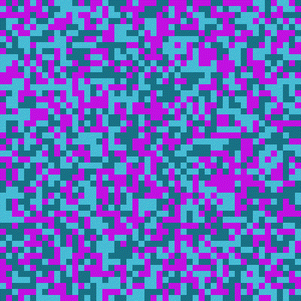

# pixelsPatterns

This is a program to generate random pixel patterns and create gifs.
Random patterns are useful in computer vision by serving as markers for orienting objects in 3D space.
* Download the latest release of [pixelsPatterns.exe](https://github.com/marcoagbarreto/pixelsPatterns/releases/download/v0.1.0/pixelsPatterns.exe).

## Example

1. Run ```pixelsPatterns.exe``` or ```pixelsPatterns.py```.
2. Hit Generate.
3. Profit.
4. Additionally, explore the menu for more options.



## Code Usage

clone the repository (no installation required, source files are sufficient):
        
    https://github.com/marcoagbarreto/pixelsPatterns.git

dependencies:

    import os
    import PIL
    import numpy
    import random
    import pick

or [download and extract the zip](https://github.com/marcoagbarreto/pixelsPatterns/archive/main.zip) into your project folder.

## Known limitations:
* Images are upscale x10 from original resolution, this might add noise to the image

